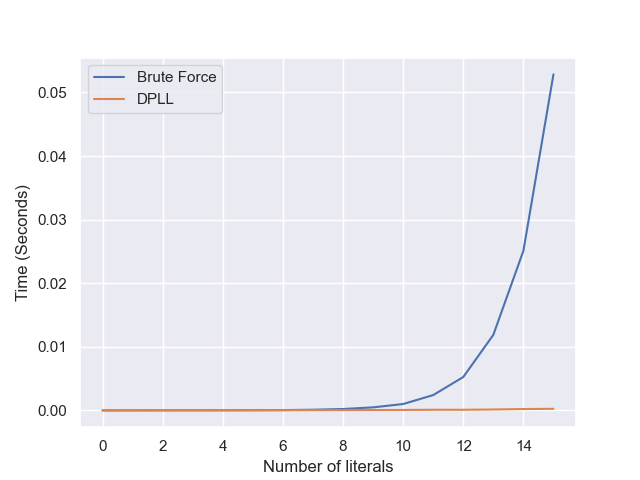

# Advanced-Algorithms-Assignment-3: 3SAT Problem

A simple implementation of a (3)SAT solver using an (unoptimized) implementation of DPLL

## Usage

```bash
$ python3 main.py --method [brute | dpll | compare] [--file [input_file] | None]
```

## Solvers

brute_force.py : brute force method, mostly for a proof of concept and understanding the problem.
dpll.py : DPLL algorithm implementation. Not optimized, but is clear and easy to understand.

## CNF

cnf_generator.py : a CNF generator that generates a random CNF formula with a given number of variables and clauses.

## Misc

dimacs.py : a parser for DIMACS CNF files.
main.py : the main file that runs the program.

## Example

Let the input be

```
p cnf 3 2
1 2 3 0
-1 -2 3 0
```

The output is

```
SAT {1: True, 2: True, 3: True}
```

Here the formula is satisfiable and the variable assignments are 1 = True, 2 = True, 3 = True.

This program does not attempt to find all possible solutions. It only finds the first solution.

## Remarks

We ran tests comparing our solution using 2000 randomly generated CNF formulas against the solution provided by py-sat, getting the same result every time.

We also compared the time it took to solve the same randomly generated CNF formulas using our brute force implementation and our DPLL implementation.
Below is a graph of averaging the time taken for each decision.

